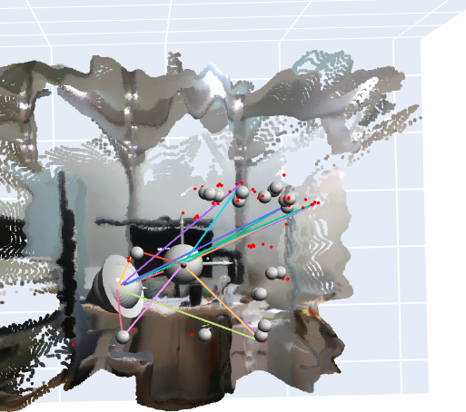

# ED-SLAM: RGB-D 센서를 활용한 향상된 깊이 SLAM

*[English Version](README.md)*

## 개요

ED-SLAM (Enhanced Depth SLAM)은 RGB 이미지 쌍에서 밀집된 3D 맵을 생성할 때 발생하는 계산상의 한계를 해결하는 컴퓨터 비전 프로젝트입니다. RGB 카메라의 스테레오 매칭에만 의존하는 대신, RGB-D 센서(특히 Intel RealSense D435i)를 활용하여 ORB 특징점 매칭을 통한 자세 추정으로 정확한 3D 맵을 효율적으로 생성합니다.

## 프로젝트 동기

RGB 이미지 쌍에서 밀집된 3D 맵을 생성하는 것은 계산 집약적이며 상당한 처리 능력을 요구합니다. RGB-D 센서의 RGB와 깊이 정보를 결합함으로써 다음과 같은 이점을 얻을 수 있습니다:

- **계산 한계 극복**: 직접적인 깊이 측정으로 복잡한 스테레오 매칭 알고리즘의 필요성 제거
- **정확도 향상**: 하드웨어 기반 깊이 센싱이 소프트웨어 기반 추정보다 신뢰할 수 있는 깊이 정보 제공
- **실시간 처리 가능**: ORB 특징점 매칭과 직접 깊이 측정의 결합으로 효율적인 자세 추정 실현
- **절대 스케일 유지**: RGB-D 센서가 메트릭 깊이 정보를 제공하여 단안 SLAM에서 흔한 스케일 드리프트 방지

## 주요 기능

### 다단계 처리 파이프라인
1. **초기 맵 구성**: RGB와 깊이 데이터를 사용하여 첫 번째 프레임에서 3D 맵 생성
2. **향상된 움직임 추정**: 정밀한 카메라 움직임 추적을 위한 ORB 특징점 매칭 및 선택적 밀집 광학 흐름 활용
3. **신뢰도 인식 깊이 매칭**: 깊이 맵 정렬을 위한 적응적 허용 오차 구현
4. **지능형 깊이 융합**: 견고한 깊이 정보 통합을 위한 다차원 신뢰도 가중치
5. **불확실성 전파**: 확률적 융합을 위한 시간에 따른 깊이 불확실성 추적

### 모듈형 아키텍처
프로젝트는 쉬운 유지보수와 확장을 위해 모듈형 설계로 구축되었습니다:

- **센서 인터페이스** (`sensors/`): RealSense D435i 카메라 통합
- **특징점 추출** (`features/`): ORB 특징점 감지 및 매칭
- **자세 추정** (`pose_estimation/`): 깊이 정보를 활용한 절대 자세 계산
- **시각화** (`visualization/`): 3D 자세 및 포인트 클라우드 시각화 도구
- **유틸리티** (`utils/`): 공통 수학적 연산 및 변환

## 설치

### 사전 요구사항
- Python 3.8+
- Intel RealSense D435i 카메라
- Intel RealSense SDK 2.0

### 필수 라이브러리
다음 명령어를 사용하여 필요한 종속성을 설치하세요:

```bash
pip install -r requirements.txt
```

## 사용법

### Jupyter 노트북을 이용한 빠른 시작

시스템의 주요 데모는 Jupyter 노트북에서 확인할 수 있습니다:

```bash
jupyter notebook src/notebooks/modular_capture_and_match.ipynb
```

이 노트북은 다음과 같은 내용을 보여줍니다:
1. **카메라 초기화**: RealSense D435i 카메라 설정
2. **특징점 추출**: 키포인트 감지를 위한 모듈형 ORB 추출기 사용
3. **특징점 매칭**: 신뢰도 분석을 포함한 견고한 매칭
4. **자세 추정**: 깊이 정보를 활용한 절대 스케일 자세 계산
5. **3D 시각화**: 포인트 클라우드 및 카메라 자세를 포함한 종합적인 결과 시각화
6. **결과 분석**: 상세한 메트릭 및 품질 평가

### 기본 사용 예제

```python
from sensors.realsense_camera import RealSenseD435i
from features.orb_extractor import ORBExtractor
from features.orb_matcher import create_orb_matcher
from pose_estimation.absolute_pose import estimate_absolute_pose_realsense

# 컴포넌트 초기화
camera = RealSenseD435i()
orb_extractor = ORBExtractor(n_features=500)
orb_matcher = create_orb_matcher(distance_threshold=50.0)

# 프레임 캡처
camera.start()
frame1 = camera.capture_frame_pair()
frame2 = camera.capture_frame_pair()

# 특징점 추출 및 매칭
kp1, desc1 = orb_extractor.extract_features(frame1['rgb'])
kp2, desc2 = orb_extractor.extract_features(frame2['rgb'])
matches, good_matches = orb_matcher.match_features(desc1, desc2)

# 절대 스케일을 포함한 자세 추정
R, t, points_3d, scale = estimate_absolute_pose_realsense(
    F, K, pts1, pts2, frame1['depth'], frame2['depth'], mask
)
```

## 결과

ED-SLAM 시스템은 RGB-D 센서를 사용하여 정확한 카메라 자세 추정과 3D 맵 재구성을 성공적으로 보여줍니다:



시각화는 재구성된 3D 특징점들과 화살표로 표시된 카메라 움직임 궤적을 보여줍니다.

## 기술적 접근법

### 향상된 움직임 추정
- **기본**: 견고한 자세 추정을 위한 ORB 특징점 디스크립터 매칭
- **선택사항**: 픽셀 레벨 움직임 세분화를 위한 밀집 광학 흐름 통합
- **하이브리드 접근법**: 희소 특징점 매칭과 밀집 흐름 정보 결합

### 신뢰도 인식 처리
시스템은 다차원 신뢰도 점수를 구현합니다:
- **특징점 매칭 신뢰도**: ORB 디스크립터 매치의 품질
- **흐름 일관성 신뢰도**: 순방향-역방향 광학 흐름 일관성
- **기하학적 신뢰도**: 스테레오 기하학 제약 조건 준수
- **시간적 신뢰도**: 시간에 따른 불확실성 모델링

### 절대 스케일 유지
단안 SLAM 시스템과 달리 ED-SLAM은 다음을 통해 메트릭 스케일을 유지합니다:
- Intel RealSense D435i 스테레오 베이스라인 활용
- 하드웨어 캘리브레이션된 깊이 측정
- 지속적인 깊이 검증을 통한 스케일 드리프트 방지

## 프로젝트 구조

```
ED-SLAM/
├── src/
│   ├── sensors/           # 카메라 인터페이스 모듈
│   ├── features/          # 특징점 추출 및 매칭
│   ├── pose_estimation/   # 자세 계산 알고리즘
│   ├── visualization/     # 3D 시각화 도구
│   ├── utils/            # 유틸리티 함수
│   └── notebooks/        # 데모 노트북
├── requirements.txt      # Python 종속성
└── README.md            # 이 파일
```

## 연구 맥락

이 프로젝트는 ORB 특징점 기반 3D 매핑의 한계를 인정하면서도 다음을 통해 실용적인 해결책을 제공하는 개선된 RGB-D SLAM 연구 접근법을 구현합니다:

- **다중 모달 센서 융합**: RGB와 깊이 정보의 효과적인 결합
- **신뢰도 인식 처리**: 측정 품질에 기반한 동적 적응
- **유연한 구현**: 희소 및 밀집 움직임 추정 모두 지원
- **하드웨어 최적화**: 실시간 성능을 위한 RealSense D435i 기능 활용

## 한계 및 향후 연구

### 현재 한계
- RGB-D 센서 가용성에 대한 의존성
- 저텍스처 환경에서의 ORB 특징점 희소성
- 신뢰도 계산의 계산 오버헤드

### 향후 개선사항
- 향상된 움직임 추정을 위한 IMU 데이터 통합
- RealSense 이외의 다른 RGB-D 센서 지원
- 루프 클로저 감지 및 전역 최적화
- 실시간 성능 최적화

## 기여

이 프로젝트는 모듈형 설계 철학을 따릅니다. 기여할 때:
1. 모듈형 아키텍처 유지
2. 포괄적인 문서화 포함
3. 적절한 시각화 기능 추가
4. RealSense D435i와의 호환성 보장